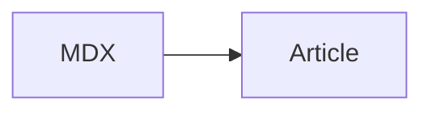

## MDX content

<aside aria-label="An MDX example">This is a local verification fixture.</aside>

Inline math also works here: $a^2 + b^2 = c^2$.

```mermaid
flowchart LR
  accTitle: MDX publishing
  accDescr: MDX content is built into an article.
  A[MDX] --> B[Article]
```
